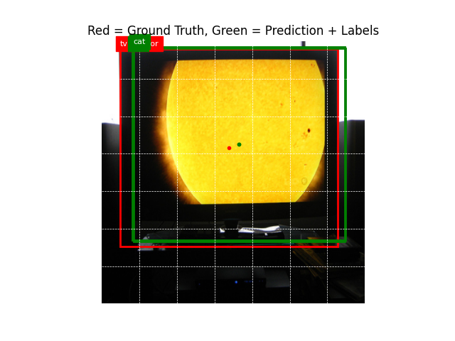
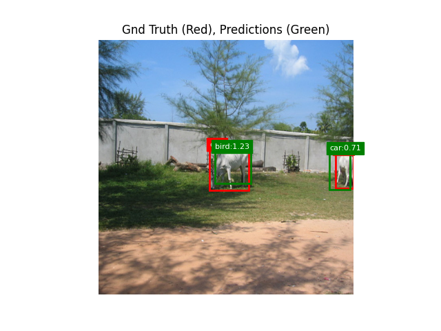
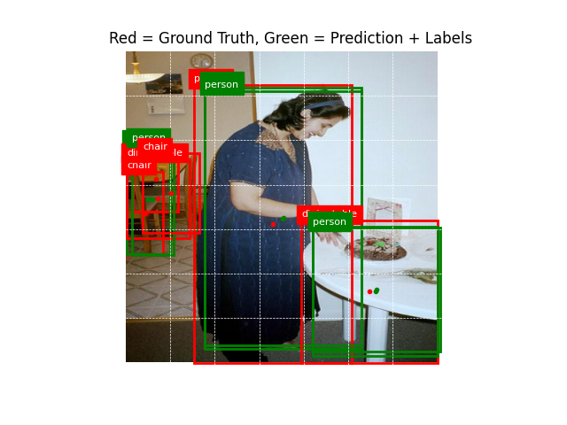

# CS 190I: Generative AI and Deep Learning

Projects for UCSB CS 190I Spring '25

Read the papers:
- [YoMAMBA - Mamba-based YOLOv1](https://github.com/ThePickleGawd/cs190i-gen-ai-projects/blob/main/papers/YoMamba.pdf)
- [Mo Bamba - Mamba-based Rap LLM](https://github.com/ThePickleGawd/cs190i-gen-ai-projects/blob/main/papers/MoBamba.pdf)

## 1. YoMAMBA

A Mamba-based YOLOv1 architecture. We compare performance with ResNet backbone.


### Prerequisites

```bash
pip install uv

# Install most compatible torch
UV_TORCH_BACKEND=auto uv pip install torch

# Sync packages
uv sync

# Yo Mamba (YOLO) requirements
uv pip install mambavision

# Mo Bamba (Finetuned LLM) Requirements
git submodule update --init --recursive
pip install git+https://github.com/huggingface/transformers.git
```

### Train

Training takes about 12 hours on RTX 3070 Ti GPU.

```bash
cd YoMamba

# Modify train.py to specify which model to train
uv run train.py

# Plot train metrics
uv run plot_loss_mAP.py
```


### Test

Test model on sample images or video

```bash
# Set flag to enable mamba. Default: ResNet backbone
uv run test_image.py --use-mamba
uv run test_video.py --use-mamba
```

### YOLOv2 - Fails Classification

My initial attempt to recreate YOLOv2. I ran into issues with exploding gradients and poor classification (despite good object detection). I've tried the following:

- Boosting classification loss
- Modifying the loss function to guarentee each target bbox gets assigned a predicted bbox
- Using log scale predictions for width and height
- Using sigmoid on x,y,conf to clamp values

| Case 1                                                          | Case 2                                                            | Case 3                                                               |
| --------------------------------------------------------------- | ----------------------------------------------------------------- | -------------------------------------------------------------------- |
|  |  |  |

#### Train Stats. Unfreezed final backbone layer after 150 epochs


## 2. Mo Bamba

A Mamba-based Rap LLM. Unfortunetly, Bamba v2 is too big for me, so I used Mamba 2 instead.

### Prerequisites

```bash
cd MoBamba/third-party

# Install causal-conv1 and mamba from source
cd causal-conv1d && uv pip install . --no-build-isolation
cd ..
cd mamba && uv pip install . --no-build-isolation

# flash-attention is not necessary unless you try Bamba.
```

### Train

```bash
cd MoBamba

# Finetune Mamba
uv run mamba2.py

# Finetune Llama (Choose training method)
uv run llama-full.py
uv run llama-lora.py
uv run llama-qlora.py

# Finetune Bamba (Needs 80gb VRAM I think)
uv run bamba-9b-v2-lora.py
```

### Inference

```bash
cd MoBamba

# Run inference on a finetuned model
uv run mamba-inference.py
uv run llama-inference.py
uv run bamba-inference.py
```

### Results

See [Model Outputs](./MoBamba/model_outputs/)

## Utils

### Running Batches on CSIL

```bash
# Connect to GPU
srun --gpus=1 --nodes=1 --time=24:00:00 --cpus-per-task=4 --pty bash

# See job queue
squeue | grep dylanlu

# Cancel job ID, find with squeue
scancel [job-id]

# Keep terminal alive
tmus new -s example
tmux ls
tmux a -t example # Attach

# Run batch
sbatch sbatch_script.sh
```
